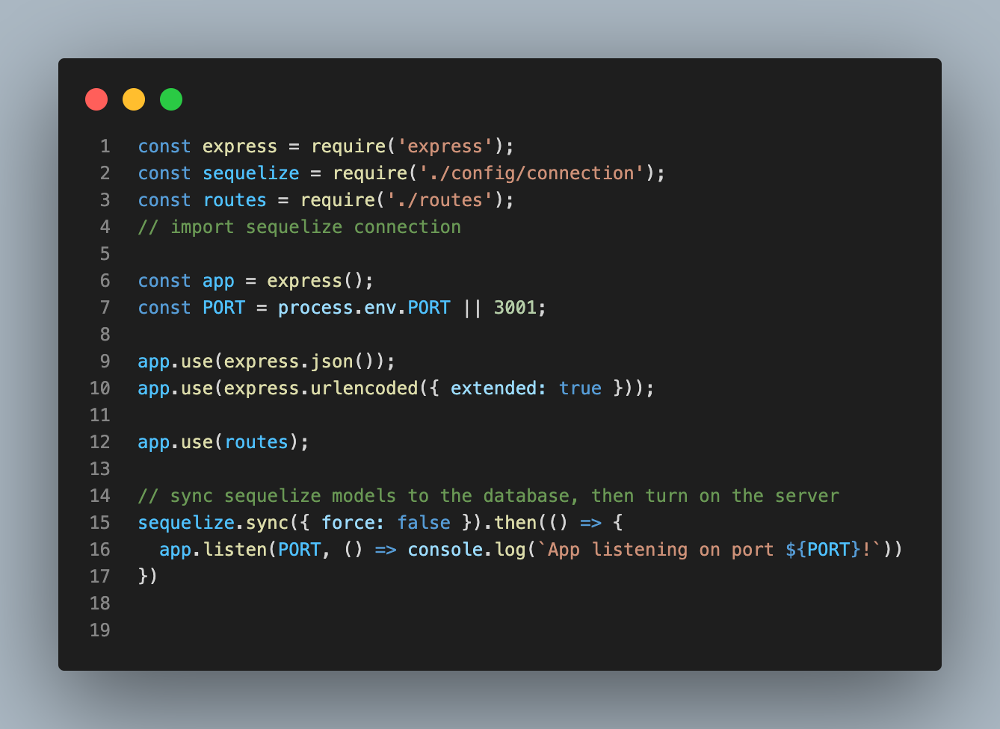
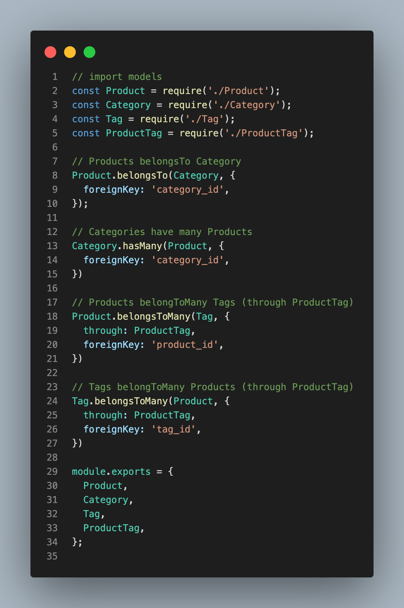
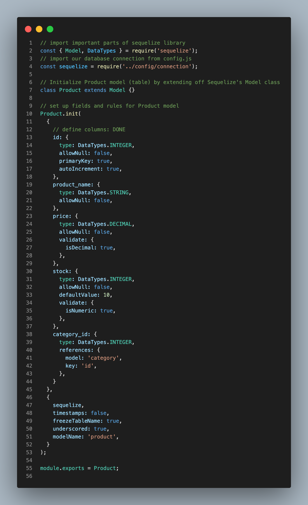
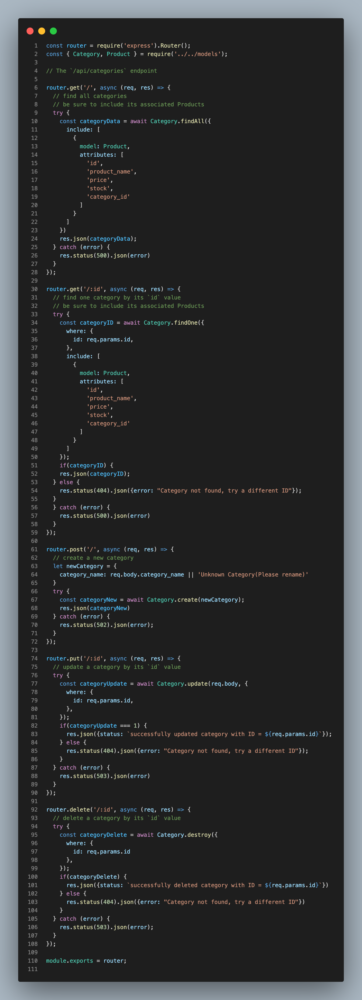

       

# Object-Relational Mapping (ORM) Challenge: E-commerce Back End

## Description

In this challenge I created a back end for an e-commerce site. This application is using  API and  to connect with a  database. 

I was able to create working back end and was able to deploy with CRUD operations using  without any errors.

## Table of Contents

* [Built With](#Built-With)
* [License](#License)
* [Screenshots](#Screenshots)
* [Links](#Links)
***

  
### Built with

- 
-  
- 
- 
- 
-  
- dotenv

## License
[MIT](https://opensource.org/licenses/MIT)

## Screenshots

## Links

1. [GitHub](https://github.com/mlcundayag/easy-shop)
2. [Video Walkthrough]()

  